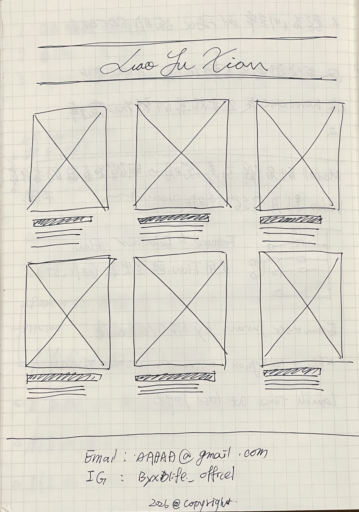

# Product Requirement Document (PRD)

## 1. Product Vision
To build a professional and personalized Personal AI Portfolio website, utilizing **Apple-like minimalist aesthetic design and smooth high-quality animations**, to demonstrate personal AI development capabilities, project achievements, and professional background to hiring managers and potential technical partners.

## 2. Target Persona

### Primary Audience: Hiring Manager / Technical Interviewer
- **Characteristics**: Time-poor, values actual output and technical depth, while appreciating high-quality design details.
- **Pain Points**: Fatigued by reviewing a large volume of resumes, hopes to quickly find the candidate's highlights and proof of practical ability.
- **Needs**: Requires an entry point to quickly understand "who" the candidate is and "what they have done", and to be attracted by a high-quality presentation.

### Secondary Audience: Potential Partner / General Visitor
- **Characteristics**: Interested in AI technology, looking for collaboration opportunities or inspiration.
- **Needs**: Clear project showcase, impressive visual experience, and simple contact information.

## 3. Visual Design

This project will adopt Minimalism and high-quality design, implemented through the following strategies:

*   **Layout**: Uses a wide-screen centered design, providing ample Negative Space for headings and key content to guide visual focus.
*   **Components**: Utilizes Glassmorphism on the navigation bar and card elements to present a lightweight and modern feel.
*   **Typography**: Selects highly recognizable and elegant sans-serif fonts, establishing a clear information hierarchy through strong contrast in font size and weight.
*   **Animation**: Implements subtle parallax scrolling and element entrance animations to create a smooth and vivid user experience, echoing the interactive quality of Apple's official website.

## 4. Feature List - MoSCoW Prioritization

### Must Have
- **Landing Page**: As the main entry point of the website, it must present a high-quality visual impact.
- **Apple-like Minimalist Design**: Uses abundant white space, selected fonts, and high-resolution assets to create a prestigious and professional atmosphere.
- **High-Quality Animations**: Includes smooth transitions, Parallax scrolling, or Micro-interactions to enhance user experience without overshadowing content.
- **About Me Introduction**: Includes a summary of personal bio, core skills, and career background.
- **Portfolio Links**: Displays titles and links of selected projects, jumping to project details or external demo links upon clicking.

### Should Have
- **Responsive Design**: Ensures good display on desktops, tablets, and mobile phones, maintaining consistent design language.
- **Social Media Links**: Links to professional communities like GitHub and LinkedIn, recommended to be integrated into the footer or navigation bar.

### Could Have
- **Detailed Project Pages**: Independent detailed description pages for each project, including tech stack and development insights.
- **Contact Form**: Allows visitors to send messages directly through the website.

### Won't Have (Not included in this iteration)
- **CMS (Content Management System)**: Initial content will be Hardcoded or managed via simple configuration files; no complex backend will be developed.
- **User Login System**: This site is for public display purposes and does not require membership functions.

## 5. Acceptance Criteria
1.  **Homepage Load Test**: When a user enters the website homepage, it should complete loading within 3 seconds and immediately show the self-introduction content (including initial entrance animation).
2.  **Visual Style Acceptance**: The overall interface should meet the "Minimalist" and "High Quality" design requirements, without cluttered layout or uncoordinated color schemes. It needs to be confirmed by the user that it achieves an Apple-like quality.
3.  **Animation Smoothness Acceptance**:
    *   All transitions and scrolling animations must maintain a smoothness of 60fps without noticeable lag.
    *   Animations on mobile devices need to be moderately simplified or optimized to avoid excessive performance consumption.
4.  **Content Accuracy**: Self-introduction text must be smooth and error-free, and portfolio links must correctly point to target web pages without Dead Links.
5.  **Portfolio Navigation**: Clicking any portfolio link should successfully open a new tab or jump to the corresponding page.
6.  **Layout Adaptability**:
    *   On wide screens (Desktop), content should be centered or reasonably laid out without excessive stretching.
    *   On mobile screens (Mobile), content should automatically stack, with text size moderate and easy to read, and no horizontal scrollbars appearing.
